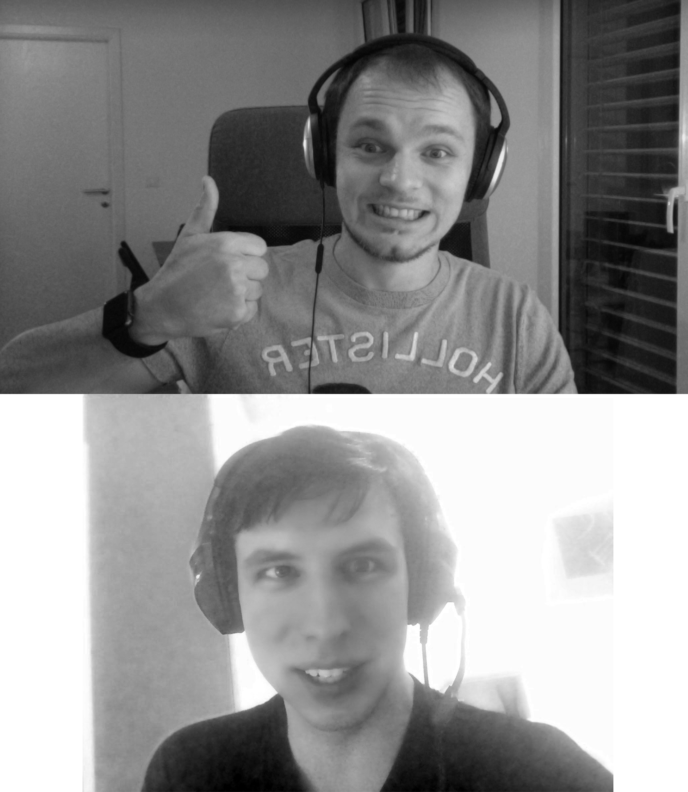

# Google Hash Code 2017

This is a repository for Google Hash Code competition, online qualification round, held in February 2017.

We took the opportunity to do a little bit of pair programming and trying the buzz of delivering a task in a short period of time, just like we did at [University](http://www.fel.cvut.cz/en/)!

All of the code is here for educational purposes. Quite frankly, we're not even sure if it's absolutely correct. But we are absolutely sure we had fun writing it.



We wrote all the code ourselves, remotely while practicing pair programming thanks to Google Hangouts.

## Final Scores

1. Kittens: 587472 points
2. Me at the zoo: 433526 points
3. Trending today: 499970 points
4. Videos worth spreading: 538604 points

> Total score: **2.059.572 points**

## How to run the code

We have released our code as a JAR file, to make it super easy to try our solution. Simply download all the resources in the release section of the repository and store them all in the same folder:

```
|-- hashcode
|     |-- hashcode-1.0.0.jar
|     |-- datasets
|           |-- kittens.in
|           |-- me_at_the_zoo.in
|           |-- trending_today.in
|           |-- videos_worth_spreading.in
```

So if you want to run the code with `trending_today.in`, you just need to run (from the folder hashcode):

```
java -jar hashcode-1.0.0.jar "datasets/trending_today.in"
```

And you will find your output file `trending_today.in.out` in the datasets folder once the computation is done.

## License

The code is licensed under MIT license.
